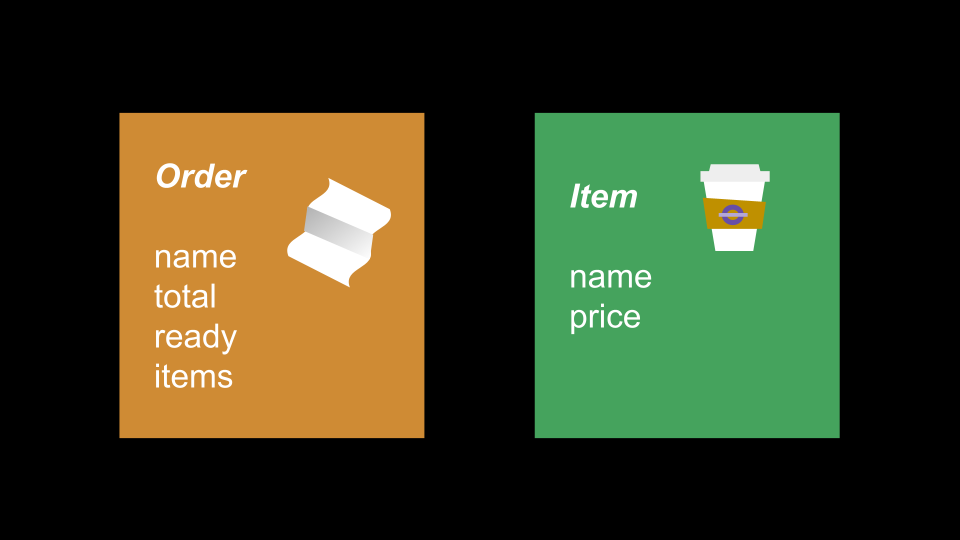

# Orders & Items

### Synopsis

<div style="text-align: center;">
    
</div>

Taking **Cafe Java** to the next level, add in some custom data types by creating 2 new classes `Order` and `Item`. They should have the following member variables:

- **Item class member variables:**
    - _`String`_ `name`
    - _`double`_ `price`
- **Order class member variables:**
    - _`String`_ `name`
    - _`double`_ `total`
    - _`boolean`_ `ready`
    - _`ArrayList<Item>`_ `items`

Of course, you will also need to demo its capabilities for the dev team, so make a TestOrders class to do this. Tip! When creating new instances don't forget the **`new`** keyword for instantiating objects!

```java
import java.util.ArrayList;

public class TestOrders {
    public static void main(String[] args) {
    
        // Menu items
    
        // Order variables -- order1, order2 etc.
    
        // Application Simulations
        // Use this example code to test various orders' updates
        System.out.printf("Name: %s\n", order1.name);
        System.out.printf("Total: %s\n", order1.total);
        System.out.printf("Ready: %s\n", order1.ready);
    }
}
```