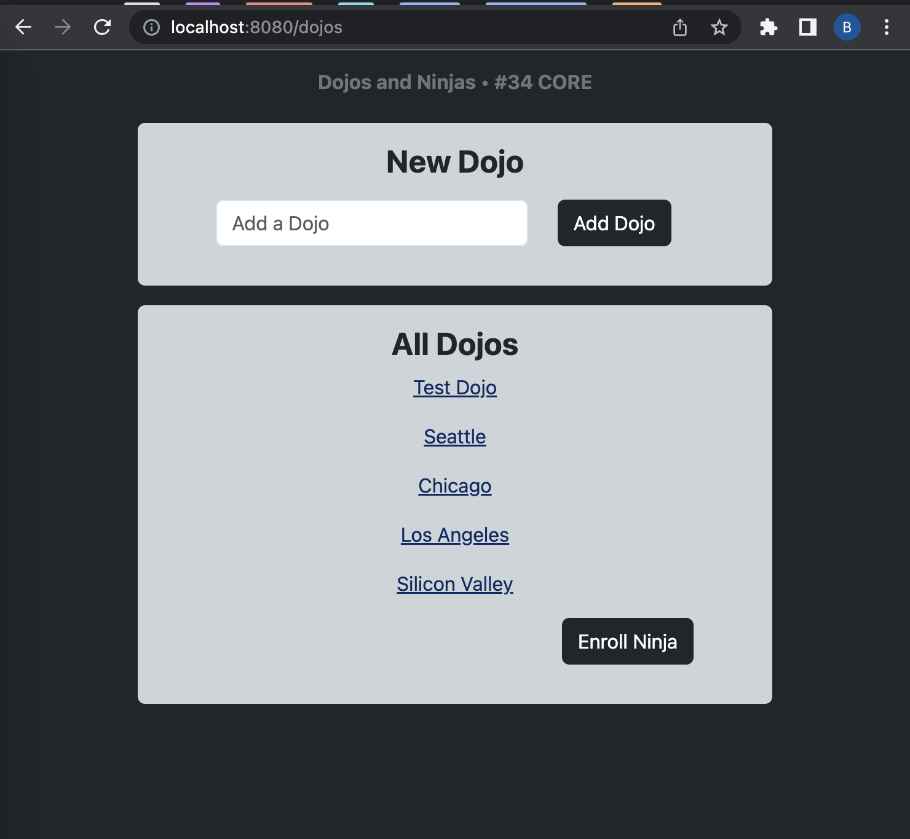

# Dojos & Ninjas

### Overview

**Dojos & Ninjas** is a Java Spring project designed to track ninjas and the dojos they're being trained in. The project follows the MVC (Model-View-Controller) architecture to manage and display dojo and ninja data through JSP (JavaServer Pages) for the view layer.

## Configuration

Database and View Configuration

1. `spring.datasource.url=jdbc:mysql://localhost:3306/java-dojos-and-ninjas?createDatabaseIfNotExist=true`: This line specifies the URL for connecting to the MySQL database. The URL indicates that the database is located on `localhost` at port `3306` and its name is `java-dojos-and-ninjas`. The `createDatabaseIfNotExist=true` parameter instructs the system to create the database if it doesn't already exist.

2. `spring.datasource.username=root`: This line specifies the username to be used when connecting to the database. In this case, it is set to `root`.

3. `spring.datasource.password=rootroot`: This line specifies the password associated with the username used to connect to the database. In this case, the password is set to `rootroot`.

4. `spring.jpa.hibernate.ddl-auto=update`: This line configures the behavior of Hibernate, the ORM (Object-Relational Mapping) framework used by Spring Data JPA. The `ddl-auto` property controls the automatic generation and update of database schema. In this case, it is set to `update`, which means that Hibernate will update the schema based on the entity classes defined in your project.

5. `spring.mvc.view.prefix=/WEB-INF/`: This line configures the prefix for resolving view templates in Spring MVC. It indicates that the view templates are located in the `/WEB-INF/` directory.

6. `spring.mvc.hiddenmethod.filter.enabled=true`: This line enables the hidden method filter in Spring MVC. This filter allows you to use the hidden input field technique for submitting forms with methods other than GET and POST, such as DELETE or PUT.

These configuration properties define various aspects of the Java Spring application, **Dojos-and-Ninjas**, including the database connection, ORM behavior, and view resolution settings.

Dependencies

A brief explanation of each dependency in the `pom.xml` file:

1. `spring-boot-starter-data-jpa`: This dependency includes the necessary libraries and configurations for using Spring Data JPA, which simplifies database access and ORM (Object-Relational Mapping) with JPA (Java Persistence API).

2. `spring-boot-starter-web`: This dependency provides the essential components for building web applications with Spring, including the embedded web server, Spring MVC, and other web-related features.

3. `spring-boot-devtools`: This dependency enables development-time features, such as automatic application restart and hot swapping of code changes, to enhance developer productivity.

4. `mysql-connector-j`: This dependency allows connectivity to a MySQL database using JDBC (Java Database Connectivity), enabling your application to interact with the MySQL database server.

5. `spring-boot-starter-tomcat`: This dependency provides the embedded Apache Tomcat server, which allows you to deploy and run your Spring application as a standalone web server.

6. `spring-boot-starter-test`: This dependency includes testing frameworks and libraries for unit and integration testing of Spring applications.

7. `jakarta.servlet.jsp.jstl-api`: This dependency provides the Jakarta Standard Tag Library (JSTL) API, which enables the usage of JSP (JavaServer Pages) tags in your application.

8. `jakarta.servlet.jsp.jstl`: This dependency includes the implementation of the JSTL tags, allowing you to use them in your JSP pages.

9. `tomcat-embed-jasper`: This dependency provides support for using JSP files with the embedded Tomcat server.

10. `jbcrypt`: This dependency is a Java implementation of the bcrypt hashing algorithm, which is commonly used for secure password hashing.

11. `spring-boot-starter-validation`: This dependency includes the necessary libraries for validating and enforcing constraints on domain models using annotations like `@NotNull`, `@Size`, etc.

12. `webjars-locator`: This dependency is a utility for locating and managing WebJar assets, which are client-side libraries packaged as JAR files.

13. `bootstrap`: This dependency includes the Bootstrap framework, which provides CSS and JavaScript components for creating responsive and visually appealing web interfaces.

These dependencies provide the necessary functionality and libraries for developing a Java Spring application with Spring Data JPA, web capabilities, database connectivity, testing support, JSP usage, password hashing, validation, and integration of Bootstrap for front-end styling and components.

## Models, Repository and Service

### The Models: **`Dojo.java`** and **`Ninja.java`**:

The **`Dojo.java`** file represents the Dojo model in the Dojos_and_Ninjas Spring project. This model class is annotated with `@Entity` and `@Table` to define it as a persistent entity in the database. It contains attributes such as `id`, `createdAt`, `updatedAt`, and `name`, which correspond to the columns in the "dojos" table. The `@OneToMany` annotation is used to establish a one-to-many relationship with the Ninja model. The Dojo class also includes getter and setter methods for accessing and modifying its attributes.

The **`Ninja.java`** file represents the Ninja model in the Dojos_and_Ninjas Spring project. Similar to the Dojo class, it is annotated with `@Entity` and `@Table` to define it as a persistent entity in the database. The Ninja model has attributes such as `id`, `createdAt`, `updatedAt`, `firstName`, `lastName`, `age`, and `dojo`. These attributes map to the columns in the "ninjas" table. The `@ManyToOne` annotation is used to establish a many-to-one relationship with the Dojo model. The Ninja class includes getter and setter methods for accessing and modifying its attributes.

In summary, the `Dojo.java` and `Ninja.java` files define the model classes for the Dojo and Ninja entities in the Dojos_and_Ninjas project. They represent the structure and behavior of the corresponding database tables and provide methods to interact with the data.

### The Repositories:  **`DojoRepository.java`** & **`NinjaRepository.java`**

The **`DojoRepository`** interface serves as the repository for the Dojo model. It extends the `CrudRepository` interface, which provides basic CRUD operations for the Dojo entity. The repository is annotated with `@Repository` to indicate that it is a Spring repository component. It includes a method `findAll()` that retrieves all dojos from the database.

The **`NinjaRepository`** interface serves as the repository for the Ninja model. It also extends the `CrudRepository` interface and is annotated with `@Repository`. Similar to `DojoRepository`, it includes a method `findAll()` to retrieve all ninjas from the database.

### The Services: **`DojoService.java`** & **`NinjaService.java`**

The **DojoService** class is a service component that provides business logic and acts as an intermediary between the controller and the DojoRepository. It is annotated with `@Service` to indicate that it is a Spring service component. The service class is responsible for handling operations related to the Dojo model. It autowires the DojoRepository to establish a connection between the service and the repository. The class includes methods such as `createDojo()`, `getAllDojos()`, `getDojoById()`, `updateDojo()`, and `deleteDojo()` to perform CRUD operations on Dojo entities.

The **NinjaService** class is similar to DojoService but handles operations related to the Ninja model. It is annotated with `@Service` and autowires the NinjaRepository. The class provides methods such as `createNinja()`, `getAllNinjas()`, `getNinjaById()`, `updateNinja()`, and `deleteNinja()` to perform CRUD operations on Ninja entities.

In summary, the repository interfaces (DojoRepository and NinjaRepository) define the methods to interact with the database for retrieving and manipulating Dojo and Ninja entities. On the other hand, the service classes (DojoService and NinjaService) provide business logic and handle the communication between the controllers and repositories.

## Controller: **`DojoNinjaController.java`**

The controller class `DojoNinjaController` handles the request mappings and acts as the intermediary between the views and services. It is annotated with `@Controller` to mark it as a Spring MVC controller component. The controller has dependencies on `NinjaService` and `DojoService`, which are autowired for dependency injection.

The controller includes various request mapping methods:

- `index()` method handles the GET request for the root URL ("/dojos") and populates the model with a list of all dojos retrieved from the `DojoService`. It also adds a new Dojo object to the model for rendering the Dojo form. The method returns the view "index.jsp".

- `addDojo()` method handles the POST request for adding a new Dojo. It uses `@ModelAttribute` to bind the submitted form data to a Dojo object. It performs validation using `BindingResult` and redirects back to the index page if there are validation errors. If the validation is successful, it saves the new Dojo using `DojoService` and redirects back to the index page.

- `enrollNinja()` method handles the POST request for enrolling a new Ninja. It follows a similar pattern as `addDojo()`, but also retrieves the list of all dojos to populate the model for the Ninja form. It validates the submitted form data, saves the new Ninja using `NinjaService`, and redirects to the show page for the associated Dojo.

- `ninjaForm()` method handles the GET request for displaying the Ninja enrollment form. It retrieves the list of all dojos to populate the model for the form and returns the view "enroll-ninja.jsp".

- `showDojoNinjas()` method handles the GET request for displaying the details of a specific Dojo and its enrolled ninjas. It retrieves the Dojo and its associated ninjas using `DojoService`, adds them to the model, and returns the view "show-dojo.jsp". The view uses JSTL `c:choose` and `c:forEach` tags to conditionally display the ninjas or a message if there are no ninjas enrolled.

## Views: 

The views are written in JSP (JavaServer Pages) and use Bootstrap for styling. They are responsible for rendering the HTML content that will be returned to the client. The views receive data from the model and use JSTL and form tags to display and manipulate the data.

- **`index.jsp`** is the main view that displays the list of all dojos and the Dojo form for adding new dojos. It uses JSTL `c:forEach` tag to iterate over the list of dojos and display their names as links. It also includes a link to the Ninja enrollment form.

- **`enroll-ninja.jsp`** is the view for the Ninja enrollment form. It displays a form with input fields for the Ninja's first name, last name, age, and a select field for choosing the associated dojo. It uses JSTL `c:forEach` tag to populate the select field with the list of dojos retrieved from the controller.

- **`show-dojo.jsp`** is the view for displaying the details of a specific Dojo and its enrolled ninjas. It uses JSTL `c:choose` tag to conditionally display the list of ninjas or a message if there are no ninjas enrolled. It uses JSTL `c:forEach` tag to iterate over the ninjas and display their details in a table.

---

In summary, **Dojos_and_Ninjas** allows users to create and manage dojos and ninjas. It implements a one-to-many relationship between dojos and ninjas, provides CRUD functionality through repositories and services, and uses a controller to handle HTTP requests and render views for the user interface.

### Screenshots

<figure style="max-width: 200px;">
    
    <figcaption>Index Homepage (Desktop)</figcaption>
</figure>

<figure style="max-width: 200px;">
    
    <figcaption>Index Homepage (Mobile)</figcaption>
</figure>

<figure style="max-width: 200px;">
    
    <figcaption>Ninja Enrollment Form (Desktop)</figcaption>
</figure>
<figure style="max-width: 200px;">
    
    <figcaption>Ninja Enrollment Form (Mobile)</figcaption>
</figure>

<figure style="max-width: 200px;">
    
    <figcaption>Dojo Showing No Ninjas</figcaption>
</figure>
<figure style="max-width: 200px;">
    
    <figcaption>Dojo Showing No Ninjas</figcaption>
</figure>

