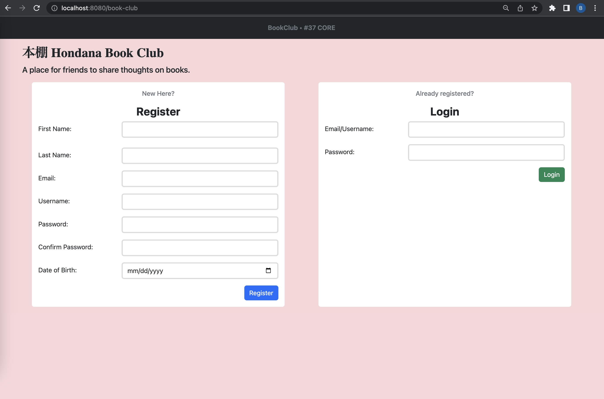
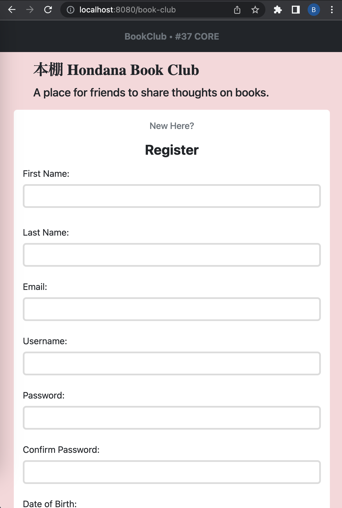

# Book Club

This Java Spring project is called BookClub. The objectives of the app is to add users to an application with Create and Read capabilities, implement a one-to-many relationship between User and another model, manage a user session (login status) by storing and reading their ID in session, and apply cumulative skills to build and de-bug a full-stack application

## Configuration

Database and View Configuration

1. `spring.datasource.url=jdbc:mysql://localhost:3306/java-book-club?createDatabaseIfNotExist=true`: This line specifies the URL for connecting to the MySQL database. The URL indicates that the database is located on `localhost` at port `3306` and its name is `java-book-club`. The `createDatabaseIfNotExist=true` parameter instructs the system to create the database if it doesn't already exist.

2. `spring.datasource.username=root`: This line specifies the username to be used when connecting to the database. In this case, it is set to `root`.

3. `spring.datasource.password=rootroot`: This line specifies the password associated with the username used to connect to the database. In this case, the password is set to `rootroot`.

4. `spring.jpa.hibernate.ddl-auto=update`: This line configures the behavior of Hibernate, the ORM (Object-Relational Mapping) framework used by Spring Data JPA. The `ddl-auto` property controls the automatic generation and update of database schema. In this case, it is set to `update`, which means that Hibernate will update the schema based on the entity classes defined in your project.

5. `spring.mvc.view.prefix=/WEB-INF/`: This line configures the prefix for resolving view templates in Spring MVC. It indicates that the view templates are located in the `/WEB-INF/` directory.

6. `spring.mvc.hiddenmethod.filter.enabled=true`: This line enables the hidden method filter in Spring MVC. This filter allows you to use the hidden input field technique for submitting forms with methods other than GET and POST, such as DELETE or PUT.

These configuration properties define various aspects of the Java Spring application, **Dojos-and-Ninjas**, including the database connection, ORM behavior, and view resolution settings.

Dependencies

A brief explanation of each dependency in the `pom.xml` file:

1. `spring-boot-starter-data-jpa`: This dependency includes the necessary libraries and configurations for using Spring Data JPA, which simplifies database access and ORM (Object-Relational Mapping) with JPA (Java Persistence API).

2. `spring-boot-starter-web`: This dependency provides the essential components for building web applications with Spring, including the embedded web server, Spring MVC, and other web-related features.

3. `spring-boot-devtools`: This dependency enables development-time features, such as automatic application restart and hot swapping of code changes, to enhance developer productivity.

4. `mysql-connector-j`: This dependency allows connectivity to a MySQL database using JDBC (Java Database Connectivity), enabling your application to interact with the MySQL database server.

5. `spring-boot-starter-tomcat`: This dependency provides the embedded Apache Tomcat server, which allows you to deploy and run your Spring application as a standalone web server.

6. `spring-boot-starter-test`: This dependency includes testing frameworks and libraries for unit and integration testing of Spring applications.

7. `jakarta.servlet.jsp.jstl-api`: This dependency provides the Jakarta Standard Tag Library (JSTL) API, which enables the usage of JSP (JavaServer Pages) tags in your application.

8. `jakarta.servlet.jsp.jstl`: This dependency includes the implementation of the JSTL tags, allowing you to use them in your JSP pages.

9. `tomcat-embed-jasper`: This dependency provides support for using JSP files with the embedded Tomcat server.

10. `jbcrypt`: This dependency is a Java implementation of the bcrypt hashing algorithm, which is commonly used for secure password hashing.

11. `spring-boot-starter-validation`: This dependency includes the necessary libraries for validating and enforcing constraints on domain models using annotations like `@NotNull`, `@Size`, etc.

12. `webjars-locator`: This dependency is a utility for locating and managing WebJar assets, which are client-side libraries packaged as JAR files.

13. `bootstrap`: This dependency includes the Bootstrap framework, which provides CSS and JavaScript components for creating responsive and visually appealing web interfaces.

These dependencies provide the necessary functionality and libraries for developing a Java Spring application with Spring Data JPA, web capabilities, database connectivity, testing support, JSP usage, password hashing, validation, and integration of Bootstrap for front-end styling and components.

## Models, Repository and Service

### The Models: **`User.java`** and **`Book.java`**

Summary of the role of each file in the BookClub Java Spring project:

1. User.java:
   The `User.java` file represents the User model in the BookClub application. It is an entity class that maps to the database table named "users." The User model encapsulates various attributes that define a user, such as first name, last name, email, username, password, and date of birth. It includes annotations for validation and persistence, such as `@NotEmpty`, `@Email`, `@Size`, `@Column`, `@DateTimeFormat`, and `@Id`. The model also establishes a one-to-many relationship with the `Book` model through the `myBooks` attribute, which represents the books that a user has. The class contains getter and setter methods for each attribute, as well as lifecycle callback methods (`@PrePersist` and `@PreUpdate`) for automatically setting `createdAt` and `updatedAt` timestamps when a new user is created or updated. Overall, this file defines the structure and behavior of the User model in the BookClub application.

2. Book.java:
   Like `User.java`, `Book.java` represents the Book model in the BookClub application and is the entity class that maps to the database table named "books." The Book model encapsulates attributes like title, author, and thoughts (regarding the book). Similar to the User model, it includes annotations for validation and persistence, such as `@NotBlank` and `@Size`. The model also establishes a many-to-one relationship with the `User` model through the `reader` attribute, which represents the user who owns the book. The `reader` attribute is annotated with `@ManyToOne` and `@JoinColumn` to specify the relationship. The class contains getter and setter methods for each attribute, as well as lifecycle callback methods (`@PrePersist` and `@PreUpdate`) for automatically setting `createdAt` and `updatedAt` timestamps when a new book is created or updated. Overall, this file defines the structure and behavior of the Book model in the BookClub application.

These two model files together form the foundation of the data structure for the BookClub application, allowing users to be created, read, and associated with their books using the one-to-many relationship. Additionally, the User model implements session management by storing and reading the user's ID in the session, allowing users to maintain their login status throughout the application. The Book model is linked to the User model to establish the connection between users and the books they own or have read. With these models, you can further build and debug the full-stack application, incorporating additional functionality and user interactions.

### The Model Validator: **`LoginUser.java`**

The `LoginUser.java` file represents a validator model in the BookClub application. It is not a persistent entity like the User and Book models; instead, it serves a different purpose related to data validation during login/authentication.

The purpose of the `LoginUser` validator model is to provide a structured and validated way to collect login information from users when they attempt to log in to the BookClub application. Since it is a validator model, it does not directly map to a database table. Instead, it is used as a form-backing bean to handle data input during the login process. When a user attempts to log in, the application will collect the login credentials and password from the login form and populate the `LoginUser` object with the input values. Before processing the login request, the validation framework in Spring (like Hibernate Validator) will automatically validate the `LoginUser` object based on the defined constraints, such as `@NotEmpty`. If any validation errors occur, appropriate error messages will be generated and returned to the user interface for display. In summary, using a separate `LoginUser` validator model helps keep the login process organized and ensures that login credentials and passwords are validated before proceeding with the authentication process. It also provides a structured way to handle login-related data and validation separately from the core User and Book models, which represent the application's main data entities.

### The Repositories: **`UserRepository.java`** and **`BookRepository.java`**

Both the `UserRepository` and `BookRepository` are interfaces that extends the `CrudRepository` provided by Spring Data JPA. It defines methods for performing CRUD (Create, Read, Update, Delete) operations on the User and Book model. The repository is annotated with `@Repository`, indicating that it is a Spring bean responsible for handling database operations related to the models.

### The Services: **`UserService.java`** and **`BookService.java`**

1. `UserService` is a service class that provides higher-level methods to handle business logic related to users. It acts as an intermediary between the controller and the `UserRepository`. The class is annotated with `@Service`, making it a Spring-managed service bean. The `UserService` includes several methods:
   - `findByUserById(Long id)`: This method retrieves a user from the database by their ID using the UserRepository's `findById` method.

   - `validateAge(User newUser, BindingResult result)`: This method performs age validation for a new user before registering them. It checks whether the user's age is at least 10 years, and if not, it adds a validation error to the `BindingResult`.

   - `registerUser(User newUser, BindingResult result)`: This method handles the user registration process. It first checks if the user's email and username are already in use. If not, it performs age validation and saves the hashed password to the database. If there are any errors during validation, it returns null to the controller for error handling.

   - `loginUser(LoginUser newLoginObject, BindingResult result)`: This method handles user login authentication. It checks whether the provided login credential (email/username) exists in the database. If found, it validates the password using the BCrypt library. If the credentials are valid, it returns the User object; otherwise, it adds a validation error to the `BindingResult`.

2. `BookService` is a service class that provides higher-level methods to handle business logic related to books. It acts as an intermediary between the controller and the `BookRepository`. The class is annotated with `@Service`, making it a Spring-managed service bean. The `BookService` includes several methods:
   - `addBook(Book newBook)`: This method saves a new book to the database using the BookRepository's `save` method.

   - `getAllBooks()`: This method retrieves all books from the database using the BookRepository's `findAll` method.

   - `getBookById(Long id)`: This method retrieves a book from the database by its ID using the BookRepository's `findById` method.

   - `updateBook(Book existingBook)`: This method updates an existing book in the database using the BookRepository's `save` method.

   - `deleteBookById(Long id)`: This method deletes a book from the database by its ID using the BookRepository's `deleteById` method.

In summary, the repository interface files (`UserRepository` and `BookRepository`) define methods for interacting with the database related to the User and Book models. On the other hand, the service classes (`UserService` and `BookService`) handle the business logic and use the respective repository interfaces to perform CRUD operations on the models. By separating these concerns, the code becomes more modular and follows the principles of the Spring framework, promoting a clean and maintainable architecture.

## Controller and Views

### The Controller: **`MainController.java`**

The **MainController** class implements the functionality of the BookClub application through various controller methods. It handles the routing, data validation, and interaction with the services to manage users, books, and user sessions. The controller also interacts with the views to display data and receive user inputs.

1. Index and Register/Login:
   - The `index` method handles the rendering of the index.jsp view, which serves as the landing page of the application. It passes a new User object and a LoginUser object to the view model.
   - The `register` method is responsible for processing user registration requests. It calls the `registerUser` method from the UserService to perform additional user registration validations. If the user registration is successful, it stores the user's ID in the session and redirects to the `/book-club/books` route. Otherwise, it returns the index.jsp view with validation errors.
   - The `login` method processes user login requests. It calls the `loginUser` method from the UserService to perform user login validations. If the login is successful, it stores the user's ID in the session and redirects to the `/book-club/books` route. Otherwise, it returns the index.jsp view with validation errors.

2. Dashboard (Home):
   - The `home` method displays the dashboard view (home.jsp), which shows all the books stored in the application. It retrieves the currently logged-in user's ID from the session, fetches the corresponding User object using the UserService, and adds it to the view model along with all the books fetched using the BookService.

3. Logout:
   - The `logout` method handles user logout requests by invalidating the session and redirecting to the root route `/`.

4. Book Functionality (Add, Show, Edit, Delete):
   - The `addBook` method renders the add-book.jsp view, allowing users to add a new book to the application.
   - The `createBookInDb` method processes the form submission for adding a new book. It performs data validation using the `BindingResult` and calls the BookService to add the new book to the database.
   - The `bookDetails` method retrieves and displays the details of a specific book in the show-book.jsp view. It fetches the book using its ID passed as a path variable and adds it to the view model along with the currently logged-in user (if available).
   - The `editBookDetails` method renders the edit-book.jsp view, allowing users to edit the details of a specific book. It retrieves the book to edit using its ID passed as a path variable and adds it to the view model.
   - The `editBook` method processes the form submission for editing a book. It performs data validation using the `BindingResult` and calls the BookService to update the book details in the database.
   - The `deleteBook` method handles the deletion of a book. It receives the book's ID as a path variable, calls the BookService to delete the book from the database, and then redirects to the `/book-club/books` route.

Overall, the MainController class orchestrates the interaction between the user interface (views) and the backend (services and repositories), allowing users to register, login, add, view, edit, and delete books. The controller ensures that data is validated, processes user inputs, and appropriately updates the views to display relevant information to the users.

### The Views

1. **index.jsp**:
   The `index.jsp` serves as the landing page for the BookClub application. It allows users to register and login. When a user submits the registration or login form, the data is sent to the respective endpoints (`/book-club/register` or `/book-club/login`) in the `MainController` for processing. The form fields, such as first name, last name, email, username, password, and date of birth, are validated using Spring's form validation annotations and error messages. If there are validation errors, the form is redisplayed with appropriate error messages. If the user successfully registers or logs in, they are redirected to the dashboard (`/book-club/books`).

2. **home.jsp**:
   The `home.jsp` is the dashboard of the BookClub application, showing all the books available in the bookshelf. It starts by greeting the logged-in user and providing options to view their username and log out. The page also allows users to add a new book to the bookshelf by clicking on the "+ Add Book to Bookshelf" link, which leads to the `add-book.jsp`. If there are books in the bookshelf, they are displayed in a table with columns for book ID, title, author, and the username of the person who added the book. The table is populated using data fetched from the `MainController` when handling the `/book-club/books` endpoint.

3. **add-book.jsp**:
   The `add-book.jsp` is used to allow users to add a new book to their bookshelf. It displays a form with fields for the book's title, author, and the user's thoughts about the book. When the user submits the form, the data is sent to the `/book-club/books/create` endpoint in the `MainController` for processing. The form fields are validated using Spring's form validation annotations, and appropriate error messages are displayed if there are any validation issues. If the book is successfully added to the bookshelf, the user is redirected back to the dashboard (`/book-club/books`) to see the updated list of books.

4. **show-book.jsp**:
   The `show-book.jsp` displays the details of a specific book from the bookshelf. It starts by displaying the book's title and author, and then it shows the user's thoughts about the book. Depending on whether the logged-in user is the same user who added the book to their bookshelf or another user who read it, the thoughts are displayed accordingly. The user-specific actions (Edit and Delete buttons) are shown only if the logged-in user is the one who added the book to their bookshelf. The page also shows the creation and, if available, the last update timestamp of the book. The `show-book.jsp` uses data passed from the `MainController` when handling the `/book-club/books/{bookId}` endpoint to populate the book details.

5. **edit-book.jsp**:
   The `edit-book.jsp` allows users to modify the details of a book they added to their bookshelf. The page displays a form with fields for the book's title, author, and thoughts. The form is pre-filled with the current data of the book, allowing users to make changes. When the form is submitted, the data is sent to the `/book-club/books/{bookId}/update` endpoint in the `MainController` for processing. The page also includes a hidden input field named "_method" with the value "put" to enable the use of the HTTP PUT method for the update operation. The form fields are validated using Spring's form validation annotations, and any validation errors are displayed appropriately. If the book details are successfully updated, the user is redirected back to the `show-book.jsp` to view the updated information.

Each of these JSP files works hand in hand with the `MainController.java` to provide a dynamic and interactive user interface for the BookClub application. The `MainController` handles the data processing, including fetching book details, handling user submissions, updating the database, and sending relevant data to the views for rendering. The JSPs, in turn, display the content, handle user input, and present the information to the users in a structured and user-friendly manner.

## Demo

    <figure style="margin-bottom: 2rem;">
        
        <figcaption>Book Club - Desktop View</figcaption>
    </figure>
    

        <figure style="margin-bottom: 2rem;">
            
            <figcaption>Book Club - Mobile View</figcaption>
        </figure>
        <figure style="margin-bottom: 2rem;">
            
            <figcaption>Book Club - User Authentication Demo</figcaption>
        </figure>
    

    <figure style="margin-bottom: 2rem;">
        
        <figcaption>Validations triggered upon invalid submission.</figcaption>
    </figure>
    <figure style="margin-bottom: 2rem;">
        
        <figcaption>Entering the Book Club app for the first time.</figcaption>
    </figure>
    <figure style="margin-bottom: 2rem;">
        
        <figcaption>Updating and Deleting Book Entries.</figcaption>
    </figure>
    <figure style="margin-bottom: 2rem;">
        
        <figcaption>Accessing own book entries vs. other users' book entries.</figcaption>
    </figure>

